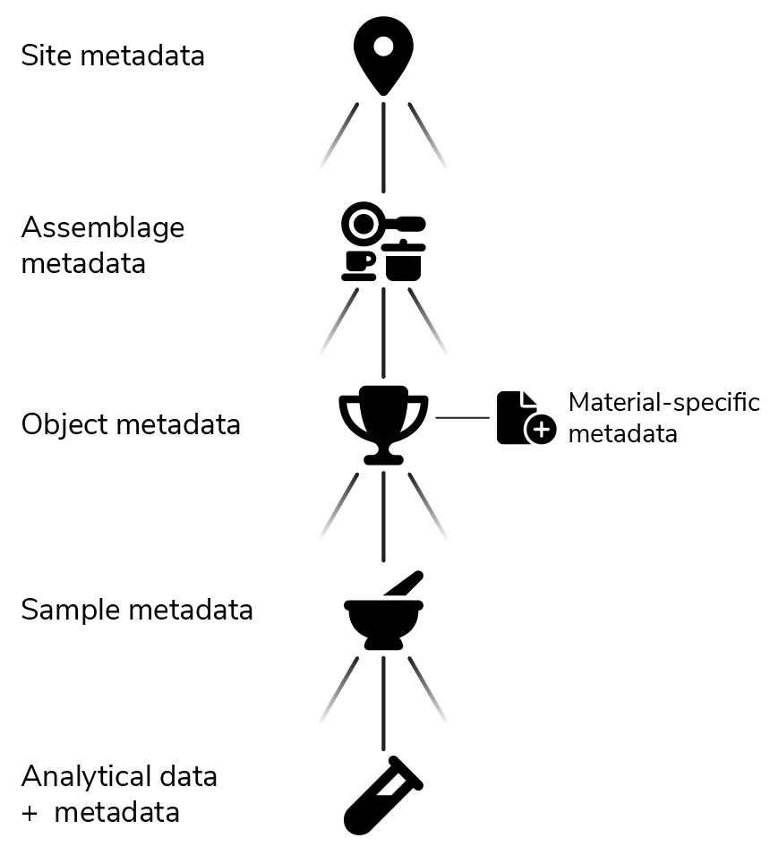

# Introduction

The TerraLID metadata profile comprehensively describes lead isotope data, their analytical background, and their geological and/or archaeological context. It aims to optimise lead isotope data for future reuse regardless of the original motivation for their measurement and the collection of the objects and samples. 

In this regard, the TerraLID metadata profile does not only serve as a data model for the TerraLID database but also aims to become a widely agreed upon community-centred reporting format for lead isotope data. When adopted by large parts of the community, the TerraLID metadata profile makes it easy to combine data from different sources, even if they are not included in the TerraLID database. 

A particular challenge for the [TerraLID Team](https://www.terralid.org/team.html) during the design of the metadata profile was finding a good balance between the information regarded as essential by modern-day standards and remaining inclusive to old data. To achieve this aim, mandatory metadata was kept to a minimum even though many others might be regarded as pivotal metadata nowadays. 

## Structure 
Efficient structuring of information as well as easy extensibility were the major technical considerations in the design of the TerraLID metadata profile. As a result, the metadata are organised in modules, which are linked in a series of one-to-many relationships: A site can yield many assemblages, which again can include many objects. Multiple samples can be taken from the same object and each sample can be analysed multiple times. 

<figure markdown="span">
  { width=500 }
  <figcaption> The general structure of the TerraLID metadata profile, highlighting the different modules and their relation to each other.   Icons taken from <a href="https://fontawesome.com/search?ic=free">Font Awesome Free</a>, owned by Fonticons, Inc. and licensed under <a href="https://creativecommons.org/licenses/by/4.0/">CC-BY 4.0 International</a>. </figcaption>
</figure>

While this seems to follow a natural hierarchy, it is possible to e.g. link an object or analysis directly to a site. Similarly, although single objects must be recorded as single-object assemblages to include their stratigraphic information, an object can also be directly linked to a site if e.g. stratigraphic information cannot be provided. An assemblage for the object can be defined at a later stage and serve as link between site and object, for example, when a second object from the same finds complex is added. 

The TerraLID metadata profile uses controlled vocabularies wherever sensible to improve searchability of the database and to decrease curation effort. The TerraLID Team is aware that these vocabularies may not yet include all terms relevant for your needs. You are therefore strongly encouraged to [reach out to us](mailto:terralid@bergbaumuseum.de) with suggestions for additional terms to be included in the vocabularies. 

## Extensibility
Another advantage of the modularity is the uncomplicated extensibility of the TerraLID metadata profile. For example, information specific for different materials is recorded in different modules. These material-specific modules extend the information recorded for all objects. Additional modules for other material types can be defined and easily included in the TerraLID metadata profile. The same applies for specific object types made of the same material: For coins, the same information like for all other metal items is recorded in addition to information specific for coins, such as their denomination. 

The same applies to analytical data. While lead isotope analyses are currently the only analytical method for which a full set of metadata exists, support for other analytical methods can be easily included in TerraLID through the inclusion of the respective modules. 

## Community participation
The initial draft of the TerraLID metadata profile was developed from 2024 to 2025 by the [TerraLID Regional](https://www.terralid.org/team.html#regional-editors) and [Material Editors](https://www.terralid.org/team.html#material-editors) during their monthly meetings with support by the [TerraLID Core Team](https://www.terralid.org/team.html#core-team). In accordance with TerraLID's [community-driven development](https://www.terralid.org/#community-driven-development), this draft is currently discussed by the entire community. [Learn more about how to join the discussion and provide feedback.](index.md)